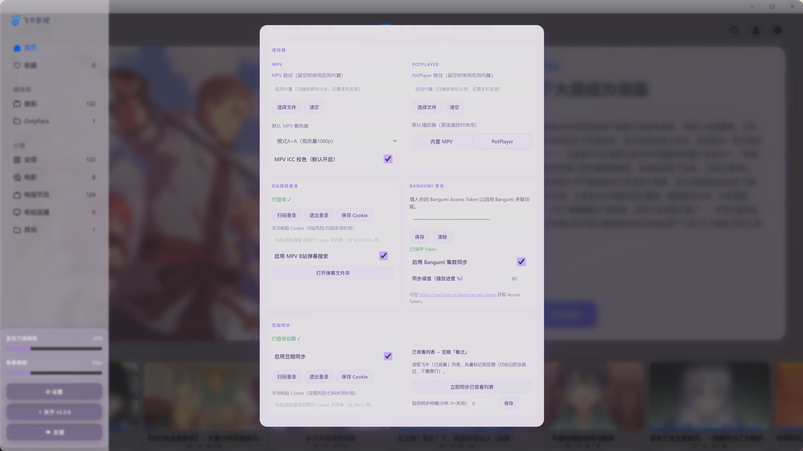

# Fntv-Plus 飞牛影视桌面客户端超级增强版

&emsp;&emsp;飞牛影视第三方桌面客户端：基于 Electron 深度封装飞牛影视（Fntv-Plus）Web 端，旨在为你提供超越浏览器的桌面体验与丰富增强功能。

<div align="center">
  
  <p><em>图：飞牛影视桌面客户端主界面</em></p>
</div>

<div align="center">
  
  <p><em>图：简单UI自定义</em></p>
</div>

<div align="center">
  
  <p><em>图：丰富自定义组件</em></p>
</div>

<div align="center">
  
  <p><em>图：支持调用PotPlayer</em></p>
</div>


## 🍴 Fork 声明

> **本项目是 [QiaoKes/fntv-electron](https://github.com/QiaoKes/fntv-electron) 的 Fork 修改版。**
>
> - **上游项目**：基于飞牛影视（fnOS TV）Web 端封装的 Electron 桌面客户端。
> - **原项目版权**：归原作者 [QiaoKes](https://github.com/QiaoKes) 所有，遵循 [GPL-3.0](LICENSE) 许可证。
> - **本仓库（[YDMY007/Fntv-Plus](https://github.com/YDMY007/Fntv-Plus)）**：在上游基础上叠加了**桌面亚克力风格、原生窗口交互、侧栏设置面板、豆瓣同步、Bangumi 集数级同步、兼容PotPlayer播放器。**等大量 UI / 体验增强，**已改动上游核心代码此后将作为独立分支独立发展，不再跟随上游更新。**（preload 注入与 main 主进程均有修改）。
> - **许可证继承**：本仓库沿用原项目的 GPL-3.0 许可证，完整条款见 [LICENSE](LICENSE) 文件。

>  **免责声明**：⚠️本项目为第三方客户端，与飞牛影视官方无关。使用前请确保遵守相关服务条款与版权规定。

---

## ✨ 本仓库增强功能

以下为本仓库相对上游新增或重构的功能，上游原版不包含。

### 首页与 UI

- **🏠 首页轮播重构（核心改动）** — 用自绘轮播替换飞牛原生首页大图区，重点打磨视觉与交互：
  - **左图右文分区**：左侧 64% 大图撑满无白边，右边缘渐隐与文字区自然融合，左上角浮动剧集 Logo 水印；右侧 36% 为浅蓝玻璃文字面板。
  - **文字层级**：`✨ 最近更新` 标签徽章 → 标题→ **两端渐隐淡蓝细线** → 简介自动获取→ 沉底「开始观看」跳转按钮
  - **纵向轮播**：上→下纵向切换动画；右侧纵向药丸指示点；6 秒自动轮播、鼠标悬停暂停、支持上下拖拽切换。
- **🌈 全网透明亚克力风格** — 整个客户端改为透桌面粉紫半透亚克力，提供自定义按钮透明度设置。
- **🌗 深浅色主题切换** — 支持浅色/深色/跟随系统三种模式，深度适配各组件 UI。

### 设置面板（侧栏「⚙ 设置」入口，居中半透面板）

- **🎬 播放器设置** — MPV 可执行文件路径自定义、PotPlayer 外部播放器支持（含续播与逐集连播，进度实时回传）、MPV 播放器着色器方案优化（10 档预设 + 自定义）
- **🔍 B站弹幕自动获取** — 扫码登录B站，一键自动获取对应番剧弹幕，追番无忧；
- **📺 豆瓣同步** — 播放进度自动标记豆瓣「在看」；飞牛「已观看列表」自动标记豆瓣「看过」。支持扫码登录与手动粘贴 Cookie，内置 CSRF 令牌自动获取与兜底。
- **📊 Bangumi 自动点格子** — 播放进度达阈值（默认 80%，可调）自动标记该集为 Bangumi「看过」+ 条目标「在看」；末集自动标整部「看过」。
- **🐛 调试日志** — 控制台日志级别开关 + 按组件单独控制；「打开日志文件」与「导出日志文件」快捷操作。

### 播放与媒体

- **🎯 字幕自动选择** — 自动匹配最佳一条中文外挂字幕（按 lang/title/评分排序），MPV 与 PotPlayer 均支持。
- **💬 B站弹幕自动匹配** — MPV 播放器自动按番名/集数匹配加载 B站弹幕；无法匹配时支持手动搜索（uosc 控制栏输入框）；弹幕标题归⼀化处理中日文书名号/引号。
- **📺 PotPlayer 外链播放器** — 支持调用系统 PotPlayer 播放，带续播（和逐集连播；每 5 秒读取播放进度回写飞牛，实现进度同步；配置隔离（内置 PotPlayer 复制到 userData，触发便携模式）。
- **🎨 MPV 着色器 / ICC** — 10 档预设着色器方案（含 anime4K）+ ICC 校色开关，通过控制，设置面板即时生效。
- **🔗 直链 / NAS 代理双模式** — 支持 302 重定向直链与 NAS 代理两种播放链路，可在设置面板切换。

### 系统与体验

- **📋 托盘菜单精简** — 托盘右键菜单只保留「退出」，其余功能全部收进侧栏设置面板。
- **🔧 侧栏实时调节** — 侧栏内透明 / 模糊滑块，实时调节客户端亚克力强度。
- **🔐 FN ID 远程登录** — 使用 FN Connect 实现远程访问，独立 OAuth 窗口 + Cookie 持久化，支持多账户管理。

---

## 📦 安装方法

### 方式一：预编译版本（推荐）

前往本仓库 [Releases 页面](https://github.com/YDMY007/Fntv-Plus/releases) 下载最新版本：

- **Windows**：下载 `FNMedia_*_win_x64.exe`，双击安装。支持自定义安装路径、创建桌面快捷方式。
- **macOS**：下载 `FNMedia_*_mac_*.dmg`，拖入 Applications 即可。
- **Linux**：下载 `FNMedia_*_linux_*.AppImage`，添加执行权限后运行。

> ⚠️ Windows 安装后如需使用 **MPV B站弹幕搜索** 功能，请确保系统已安装 Python 3（`python` / `python3` 在 PATH 中，或安装有 WorkBuddy 自带的 Python 运行时）。

### 方式二：本地构建

```bash
# 1. 克隆仓库
git clone https://github.com/YDMY007/Fntv-Plus.git
cd Fntv-Plus

# 2. 安装依赖（需 Node.js 18+）
npm install

# 3. 调试运行（编译 TypeScript + 编译 Go 代理 + 启动 Electron）
npm start

# 4. 打包安装包
npm run build:win    # Windows
npm run build:mac    # macOS
npm run build:linux  # Linux
```

> **调试提示**：本客户端使用单实例锁 + 系统托盘，**关闭窗口 ≠ 结束进程**。修改代码后重新调试前，先结束残留的 `electron.exe`：
> ```powershell
> taskkill /f /im electron.exe
> ```
> 然后执行 `npm start` 即可看到最新改动。

---

## 🎯 主要功能（继承自上游）

- **原生桌面体验** — 基于飞牛影视 Web 端构建的桌面应用，提供类原生体验。
- **多账户管理** — 支持自动登录，支持多账户管理，自由切换账户和服务器。
- **远程访问** — 支持使用 FN Connect，通过 FN ID 登录实现远程访问。
- **硬解播放** — 使用 MPV 播放器，支持 H264 / HEVC / VP9 / AV1 等编码格式。
- **进度回传** — MPV 播放器支持实时将进度回传到飞牛服务器。
- **弹幕支持** — MPV 播放器支持弹幕自动匹配加载，无法匹配时支持手动搜索。
- **视频增强** — 内置 anime4K 着色器以及对应预设模式。
- **智能跳过** — 可在 MPV 播放器界面设置，支持三种跳过片头片尾模式：章节检查、手动设置片头片尾、快捷键跳过固定时长。
- **跨平台支持** — 支持 Windows、macOS 和 Linux。

---

## ⌨️ MPV 播放器

1. **快捷键**

```text
部分快捷键兼容 PotPlayer
查看安装目录下：
third_party\fntv-mpv\portable_config\input.conf
```

2. **MPV 配置**由以下仓库单独管理：[fntv-mpv-config](https://github.com/QiaoKes/fntv-mpv-config)
3. **预设着色器方案**：[mpv.conf](https://github.com/QiaoKes/fntv-mpv-config/blob/release/custom_config/mpv/mpv.conf)

---

## 🎮 PotPlayer 播放器

1. **快捷键**

```text
PotPlayer 使用其自带快捷键体系（与 MPV 默认不完全一致）
完整快捷键可在 PotPlayer 菜单（右键 → 选项 → 快捷键）中查看与自定义
```

2. **PotPlayer 配置** — 本程序内置便携版 PotPlayer（自动复制到用户数据目录 `userData/potplayer` 并生成空 `PotPlayerMini64.ini` 触发便携模式，配置与系统安装版互不干扰）。

3. **进度回传助手** — 内置 `potctl.exe` 每 5 秒读取 PotPlayer 播放进度并回写飞牛，实现续播与逐集连播（详见设置面板「播放器」）。

---

## 🙏 特别感谢

本项目的上游与依赖参考以下开源项目：

**上游 / Fork 来源**
- [QiaoKes/fntv-electron](https://github.com/QiaoKes/fntv-electron) - 上游项目（本仓库 Fork 来源）
- [QiaoKes/fntv-mpv-config](https://github.com/QiaoKes/fntv-mpv-config) - MPV 配置与预设着色器方案来源（本项目的 `portable_config` 基于此管理）
- [fnos-tv](https://github.com/thshu/fnos-tv) - 支持弹幕的飞牛影视
- [fnToPotplayer](https://github.com/gudqs7/fnToPotplayer) - 飞牛影视调用 PotPlayer 的集成逻辑

**播放内核 / 解码补丁**
- [mpv](https://github.com/mpv-player/mpv) - 内置 MPV 播放内核
- [PotPlayer](https://potplayer.daum.net/) - 内置 PotPlayer 播放器（Kakao/DAUM）
- [enable-chromium-hevc-hardware-decoding](https://github.com/StaZhu/enable-chromium-hevc-hardware-decoding) - Chromium HEVC 硬解码支持
- [electron-media-patch](https://github.com/5rahim/electron-media-patch) - Electron 硬解码补丁

**弹幕 / 画质（MPV 脚本与着色器）**
- [tomasklaen/uosc](https://github.com/tomasklaen/uosc) - MPV 现代化 UI 框架（uosc_danmaku 弹幕插件基于此构建）
- [Tony15246/uosc_danmaku](https://github.com/Tony15246/uosc_danmaku) - 基于 uosc 的 B站 / 弹弹play 弹幕插件
- [bloc97/Anime4K](https://github.com/bloc97/Anime4K) - Anime4K 超分辨率 / 降噪着色器（画质增强模式核心）
- [弹弹play 开放弹幕网络](https://www.dandanplay.com) - 番剧识别与弹幕匹配 API（[开放平台文档](https://doc.dandanplay.com/open/)）
- [Bangumi API](https://bangumi.github.io/api/) - 番剧条目与单集同步 API（[api.bgm.tv](https://api.bgm.tv)，支撑「Bangumi 自动点格子」集数级同步）

---

## 📄 许可证

本项目采用 [GPL-3.0 许可证](LICENSE)。

- **原项目版权**：Copyright (c) 原作者 [QiaoKes/fntv-electron](https://github.com/QiaoKes/fntv-electron)
- **本仓库修改署名**：YDMY007（Fork 修改版，含桌面亚克力风格 / 原生窗口交互 / 侧栏设置面板 / 托盘精简 / 弹幕切集修复等增强）
