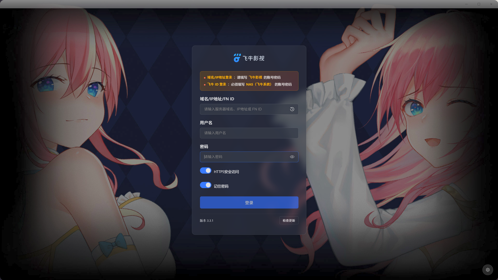
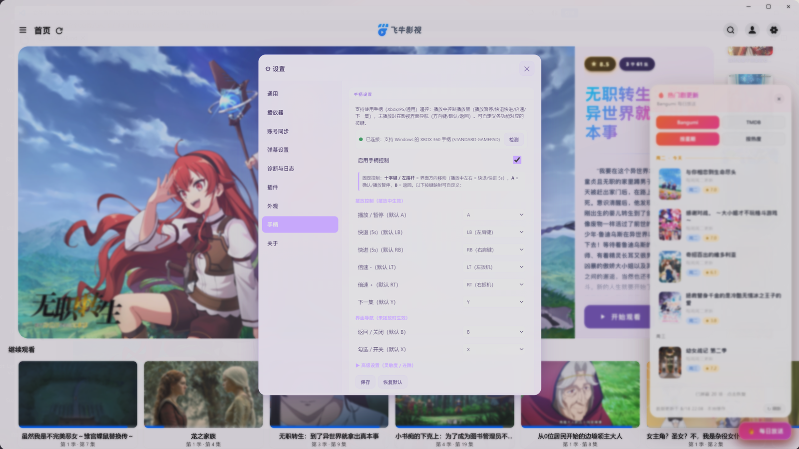
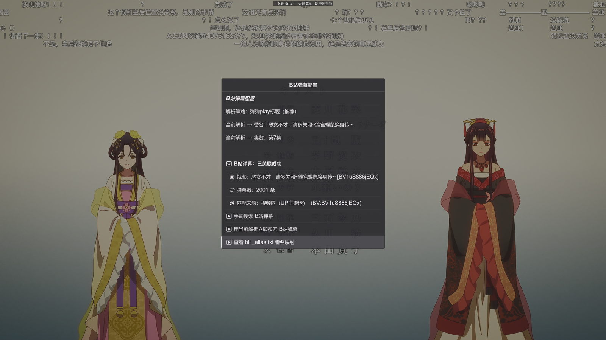

# Fntv-Plus 飞牛影视桌面客户端 · 增强版

&emsp;&emsp;Fntv-Plus 是一款基于飞牛影视 Web 端、用 Electron 打造的第三方桌面客户端，在原生体验之上叠加了亚克力透明界面、手柄控制、观影记录、弹幕/豆瓣/Bangumi 同步等大量增强功能，支持 Windows / macOS / Linux 三平台。

<div align="center">
  
  <p><em>图：飞牛影视桌面客户端主界面</em></p>
</div>

<div align="center">
  
  <p><em>图：兼容使用原生NAS界面</em></p>
</div>

<div align="center">
  
  <p><em>图：支持多种登录方式（域名 / IP 地址 / FN ID 远程）</em></p>
</div>

<div align="center">
  
  <p><em>图：丰富自定义组件</em></p>
</div>

<div align="center">
  
  <p><em>图：兼容手柄控制</em></p>
</div>

<div align="center">
  
  <p><em>图：支持调用 PotPlayer / MPV 外链播放</em></p>
</div>

<div align="center">
  
  <p><em>图：丰富B站弹幕获取</em></p>
</div>

<div align="center">
  
  <p><em>图：本地化记录观影历史</em></p>
</div>

---

## 🍴 Fork 声明

> **本项目是 [QiaoKes/fntv-electron](https://github.com/QiaoKes/fntv-electron) 的 Fork 修改版。**
>
> - **上游项目**：基于飞牛影视（fnOS TV）Web 端封装的 Electron 桌面客户端。
> - **原项目版权**：归原作者 [QiaoKes](https://github.com/QiaoKes) 所有，遵循 [GPL-3.0](LICENSE) 许可证。
> - **本仓库（[YDMY007/fntv-plus](https://gitee.com/YDMY007/fntv-plus)）**：在上游基础上叠加了**桌面亚克力风格、原生窗口交互、侧栏设置面板、豆瓣同步、Bangumi 集数级同步、兼容 PotPlayer / MPV 外链播放器、手柄控制、观影记录等大量 UI / 体验增强**，**已改动上游核心代码，此后作为独立分支独立发展，不再跟随上游更新。**（preload 注入与 main 主进程均有修改）。
> - **许可证继承**：本仓库沿用原项目的 GPL-3.0 许可证，完整条款见 [LICENSE](LICENSE) 文件。

> **⚠️ 免责声明**：本项目为第三方客户端，与飞牛影视官方无关。本项目仅为作者本人**个人练手 / 学习用途**的开源项目，不代表任何官方立场，亦与飞牛影视官方不存在任何关联或合作关系。使用前请确保遵守相关服务条款与版权规定，因使用本项目产生的任何后果由使用者自行承担。

---

## ✨ 主要功能

> 每个功能点下面补充了具体场景与操作步骤说明，方便上手。

### 首页与界面

- **🏠 首页轮播重构（核心改动）** — 用自绘轮播替换飞牛原生首页大图区，重点打磨视觉与交互：
  - **左图右文分区**：左侧 64% 大图撑满无白边，右边缘渐隐与文字区自然融合，左上角浮动剧集 Logo 水印；右侧 36% 为浅蓝玻璃文字面板。
  - **文字层级**：`✨ 最近更新` 标签徽章 → 标题 → **两端渐隐淡蓝细线** → 简介自动获取 → 沉底「开始观看」跳转按钮。
  - **纵向轮播**：上 → 下纵向切换动画；右侧纵向药丸指示点；6 秒自动轮播、鼠标悬停暂停、支持上下拖拽切换。
  - 💡 打开客户端首页即自动轮播「最近更新」；鼠标移到轮播区会暂停，可上下拖拽手动切条；想直接看某部，点右下角「开始观看」即跳转到对应详情播放页，无需先点进列表。

- **🌈 全网透明亚克力风格** — 整个客户端改为透桌面粉紫半透亚克力，提供自定义按钮透明度设置。
  - 💡 适合把影视窗口半透明地浮在桌面 / 浏览器上方时，能透出后面的内容；觉得太透或太实，去设置面板拖「透明度 / 模糊」滑块即可实时调整，不重启生效。

- **🌗 深浅色主题切换** — 支持浅色 / 深色 / 跟随系统三种模式，深度适配各组件 UI。
  - 💡 白天用浅色、晚上用深色；选「跟随系统」后客户端随 Windows / macOS 的明暗自动切换，不用手动改。

- **🔥 每日放送浮窗** — 首页右下角悬浮「每日放送」浮窗，支持多数据源切换查看每日新番 / 热门影视：
  - **三数据源可切换**：Bangumi 每日放送（动画向）、TMDB（电影 / 剧集）、**豆瓣**（国内直连、免 Token，**默认源**）；设置面板可切换。
  - **仅在首页显示**：切到详情 / 播放 / 搜索 / 列表等页面自动隐藏，避免遮挡内容。
  - **接口限流保护**：每日磁盘缓存（24h 内至多请求一次），底部显示「数据更新于 HH:MM」，并提供「↻ 刷新」按钮手动强制刷新，避免被数据源限流 / 封禁。
  - 💡 追番党把数据源切到「Bangumi」看当天新番；想看电影剧集更新切「TMDB」；懒得配置就用默认「豆瓣」。只在首页出现，进其他页面自动收起，不挡内容；数据每天最多拉一次，急看当天更新点浮窗里的「↻ 刷新」强制更新。

### 设置面板（侧栏「⚙ 设置」入口，居中半透面板）

- **🎬 播放器设置** — MPV、PotPlayer 外部播放器支持（含续播与逐集连播，进度实时回传）、MPV 播放器着色器方案优化（10 档预设 + 自定义）。
  - 💡 在「播放器」分类里选默认用 MPV 还是 PotPlayer；看完一集想自动播下一集、并让进度回到飞牛，把「续播 / 逐集连播」打开即可。MPV 画质档位（含 Anime4K 等 10 档）也在这里选。

- **🔍 B 站弹幕自动获取** — 扫码登录 B 站，一键自动获取对应番剧弹幕，追番无忧；无法匹配时支持手动搜索。
  - 💡 设置里用 B 站 App 扫码登录一次（Cookie 本地加密保存）；之后用 MPV 看番，客户端会按「番名 + 集数」自动匹配并加载 B 站弹幕。极少数字幕组命名对不上时，弹幕面板里可手动搜索该番。

- **📺 豆瓣同步** — 播放进度自动标记豆瓣「在看」；飞牛「已观看列表」自动标记豆瓣「看过」。
  - 💡 开启后在飞牛里开始看一部片子，豆瓣对应条目自动标「在看」；看到飞牛「已观看」状态后，豆瓣自动标「看过」。适合用豆瓣当个人影视档案的人，不用手动维护。

- **📊 Bangumi 自动点格子** — 播放进度达阈值（默认 80%）自动标记该集为 Bangumi「看过」+ 条目标「在看」；末集自动标整部「看过」。
  - 💡 追番时打开此功能，每看完一集的 80% 进度，Bangumi 上那集自动变「看过」、整部标「在看」；看到最后一集自动把整部标「看过」。不用每集去 Bangumi 手动点，进度由飞牛播放回传驱动。

- **🐛 调试日志** — 控制台日志级别开关 + 按组件单独控制；「打开日志文件」与「导出日志文件」快捷操作。
  - 💡 播放 / 弹幕 / 同步等某个功能不正常时，到「调试日志」把对应组件的级别调到 DEBUG，复现一次问题，点「导出日志文件」把日志发给开发者排查；平时保持默认级别不影响性能。

- **🧩 插件面板** — 把 MPV 内置脚本能力封装成 GUI 可控插件；内置「跳过片头片尾」开关（自动加载飞牛 / theintrodb 跳过数据，可显示跳过按钮或自动跳过）。使用与开发详见本地 `resource/wiki/插件开发与使用文档.md`。
  - 💡 打开「跳过片头片尾」后，有片头片尾数据的剧集会在播放时自动（或显示按钮让你点）跳过；数据来自飞牛自带与 theintrodb，无需自己手填时间点。

### 播放与媒体

- **🎯 字幕自动选择** — 自动匹配最佳一条中文外挂字幕（按 lang / title / 评分排序），MPV 与 PotPlayer 均支持。
  - 💡 影片带多语言外挂字幕时，客户端按「中文 > 标题匹配 > 评分」自动挑一条挂上，不用每次手动选；想换条也能在播放器内手动切。

- **💬 B 站弹幕自动匹配** — MPV 播放器自动按番名 / 集数匹配加载 B 站弹幕；无法匹配时支持手动搜索。
  - 💡 同「B 站弹幕自动获取」，这里强调播放侧——用 MPV 播放番剧时，弹幕会随视频自动按「番名 + 集数」匹配浮现；命名对不上时支持在弹幕面板手动搜索补全。

- **🎮 手柄控制** — 支持使用游戏手柄在应用内导航与操控播放：
  - **焦点导航**：以高亮白框替代鼠标指针，方向键移动焦点、A 键确认（等效点击），无需鼠标即可完成界面操作。
  - **媒体控制**：通过手柄即可控制播放 / 暂停、快进快退、音量等。
  - **自定义映射**：设置面板新增「手柄」分类，可对手柄按键进行个性化映射与高级参数调节。
  - 💡 把 Xbox / PS 等手柄接上（USB 或蓝牙），在沙发上也能用——方向键移动屏幕上的「高亮白框」（等同于鼠标焦点），A 键等于点击，B 键返回 / 关弹窗；进播放页后可直接用手柄控制暂停、快进快退、音量。按键不顺手就去设置「手柄」分类重新映射，还能调摇杆死区、连跳速度等高级参数。

- **📺 PotPlayer 外链播放器** — 支持调用系统 PotPlayer 播放，带续播和逐集连播；每 5 秒读取播放进度回写飞牛，实现进度同步。
  - 💡 在影片详情页点「PotPlayer 播放」按钮（与原生播放按钮并排），即用你系统里的 PotPlayer 打开；关掉窗口前客户端每 5 秒把进度回写给飞牛，下次在飞牛任意端都能续上。适合习惯 PotPlayer 快捷键 / 滤镜的用户。

- **🎨 MPV 着色器 / ICC** — 10 档预设着色器方案（含 Anime4K）+ ICC 校色开关，设置面板即时生效。
  - 💡 动画党选 Anime4K 相关预设提升锐度 / 降噪；有校色文件的显示器开 ICC 开关让颜色更准确。选完即时生效，不用重启播放器。

- **🔗 直链 / NAS 代理双模式** — 支持 302 重定向直链与 NAS 代理两种播放链路，可在设置面板切换。
  - 💡 默认直链（302 跳转）最快；若家里 NAS 是自建证书、或某些片源直链在弱网下黑屏缓冲，切到「NAS 代理」模式让客户端自带 Go 代理中转流媒体，避开直链兼容 / 缓冲问题。

- **📼 观影记录** — 新增「观影记录」面板，集中回顾观看足迹：按「已看完 / 在观看」分区，含封面、标题、总时长与最后观看时间；已打分作品显示五星评分；支持年 / 季 / 月 / 周多范围观影活动热力图；可跳转飞牛对应作品详情页。
  - 💡 从侧栏入口打开「观影记录」，一眼看到「在看到哪 / 已看完哪些」；打过分的作品封面顶部显示五星。点顶部的「年 / 季 / 月 / 周」切换，下方方格热力图会显示你每天看片的密度（没看的日期留白），回看自己的观影习惯很直观。想重看某部，点条目里的「查看详情」直接跳回飞牛对应播放页。

### 系统与体验

- **📋 托盘菜单精简** — 托盘右键菜单只保留「退出」，其余功能全部收进侧栏设置面板。
  - 💡 右下角托盘图标只用来退出程序，避免误点弹一堆选项；所有功能（设置、观影记录等）都从应用内左侧「⚙ 设置」侧栏进，路径统一。

- **🔧 侧栏实时调节** — 侧栏内透明 / 模糊滑块，实时调节客户端亚克力强度。
  - 💡 打开左侧设置侧栏，拖「透明 / 模糊」滑块即可边拖边看效果，马上套用到整个窗口，不用保存或重启。

- **🔐 FN ID 远程登录** — 使用 FN Connect 实现远程访问，独立 OAuth 窗口 + Cookie 持久化，支持多账户管理。
  - 💡 不在家想访问家里 NAS 影视时，用 FN ID（FN Connect）登录，会弹出独立授权窗口，登录后 Cookie 本地保存，下次自动连；家里有多台飞牛 / 多账号可在登录管理里切换。

### 继承自上游的基础能力

- **原生桌面体验** — 基于飞牛影视 Web 端构建的桌面应用，提供类原生体验。
  - 💡 直接当独立桌面程序用，比开浏览器标签页更顺手，窗口、托盘、快捷键都是桌面级的。
- **多账户管理** — 支持自动登录，支持多账户管理，自由切换账户和服务器。
  - 💡 多个飞牛账号 / 多台服务器可在登录处添加并一键切换，重启后自动登录。
- **远程访问** — 支持使用 FN Connect，通过 FN ID 登录实现远程访问。
  - 💡 见上方「FN ID 远程登录」，出门也能看家里 NAS 的片。
- **硬解播放** — 使用 MPV 播放器，支持 H264 / HEVC / VP9 / AV1 等编码格式。
  - 💡 4K / 高码率影片交给 MPV 硬解，CPU 占用低、不卡顿，显卡支持即可。
- **进度回传** — MPV / PotPlayer 播放器支持实时将进度回传到飞牛服务器。
  - 💡 用外部播放器看到哪，飞牛网页 / App / 电视端都能接着看，进度自动同步。
- **弹幕支持** — MPV 播放器支持弹幕自动匹配加载，无法匹配时支持手动搜索。
  - 💡 见上方「B 站弹幕自动匹配 / 获取」。
- **视频增强** — 内置 Anime4K 着色器以及对应预设模式。
  - 💡 见上方「MPV 着色器 / ICC」，动画画质一键增强。
- **智能跳过** — 三种跳过片头片尾模式（章节检查 / 手动设置 / 快捷键跳过固定时长），设置面板「插件」分类提供「自动跳过片头片尾」开关。
  - 💡 嫌每集开头广告 / OP 烦，开启自动跳过（按章节或 theintrodb 数据）；没有数据也能自己设片头片尾时间点，或播放时按快捷键跳固定时长。
- **跨平台支持** — 支持 Windows、macOS 和 Linux。
  - 💡 同一套仓库出三平台安装包，Windows 手动上传、macOS / Linux 由 GitHub Actions 自动构建，去 Releases 下对应包即可。

---

## 📁 项目结构

```text
Fntv-Plus/
├── src/                          # 源码（TypeScript）
│   ├── main/                     # Electron 主进程
│   │   ├── main.ts               # 程序入口：窗口创建、生命周期、托盘、单实例锁
│   │   ├── common/               # 主进程公共工具与类型
│   │   ├── patchOverlay.ts       # 热补丁文件级覆盖钩子（Module._resolveFilename）
│   │   └── handlers/             # IPC 处理器
│   │       ├── core/             # 核心 IPC（窗口、导航、配置读写、登录拦截）
│   │       └── plugins/          # 功能 IPC（豆瓣 / Bangumi / 弹幕 / 播放器 / patch 等）
│   ├── preload/                  # 预加载脚本（隔离上下文桥接飞牛 Web 与 Node）
│   │   ├── index.ts              # preload 入口
│   │   ├── core/                 # 注入飞牛 Web 的钩子 / 工具 / 类型
│   │   └── plugins/              # 注入侧功能模块（embyWall / gamepad / glassUI / watchHistory ...）
│   ├── modules/                  # 可复用业务模块
│   │   ├── cert_trust/           # 证书信任（NAS 自签 https）
│   │   ├── danmaku/              # B 站弹幕：获取 / 合并 / 叠层 / 字幕合并
│   │   ├── fn_api/               # 飞牛影视 API 封装（api / request / types）
│   │   ├── fn_config/            # 配置持久化（AES-256 加密，存 userData/config.json）
│   │   ├── logger/               # 分级日志 + 敏感信息脱敏
│   │   ├── players/              # 播放器抽象层（factory / index / types / impl: mpv & potplayer）
│   │   ├── proxy/                # NAS 代理服务（Go 源码，构建为 proxy[.exe]）
│   │   ├── proxyAgent.ts         # 代理客户端封装
│   │   ├── patcher/              # 热补丁解析与覆盖逻辑
│   │   └── updater/              # 更新检查（Gitee 公开 raw 检测 + 镜像兜底）
│   └── public/                   # 静态资源（注入 HTML / CSS 模板）
├── third_party/                  # 第三方依赖（仅文本 / 配置入库，二进制由 CI / go build 生成）
│   ├── fntv-mpv/                 # MPV 便携配置（uosc 脚本 / 着色器 / mpv.conf / 字体）
│   ├── potplayer/                # 内置便携版 PotPlayer（运行时复制，不入库）
│   ├── anime/                    # 番剧匹配辅助资源（anime.min.js）
│   └── proxy/                    # Go 代理源码（proxy[.exe] 构建时生成）
├── resource/                     # 文档与图片
│   ├── docs/                     # README 截图（simple / Settings / Detailsettings / Potplayer / login / hotlist）
│   ├── login/                    # 登录相关资源
│   └── wiki/                     # 使用手册 / 插件文档 / 更新检测源（update-check.json）
├── scripts/                      # 构建辅助脚本（图标生成 / potplayer 复制 / 发布等）
├── build/                        # 打包资源（icon / entitlements.mac.plist，供 electron-builder）
├── .github/workflows/            # 自动构建（release.yml：macOS / Linux 自动，Windows 手传）
├── package.json                  # 依赖与打包配置（artifactName = Fntv-Plus_*）
├── tsconfig.json                 # TypeScript 配置
├── dev.cmd                       # 开发调试（taskkill → tsc → electron）
└── README.md                     # 本文件
```

---

## 📦 安装与下载

### 预编译版本（推荐）

前往 GitHub [Releases 页面](https://github.com/YDMY007/Fntv-Plus/releases) 下载最新版本（国内 Gitee 不提供大文件托管，发行包统一托管于 GitHub）：

| 平台 | 文件类型 | 说明 |
|------|----------|------|
| 💻 Windows | `Fntv-Plus_<ver>_win_x64.exe` | **由维护者手动上传至本 Release**（不通过自动构建）。NSIS 安装包，支持自定义安装路径、创建桌面 / 开始菜单快捷方式。 |
| 🍎 macOS | `Fntv-Plus_<ver>_mac_<arch>.dmg` | 磁盘镜像，拖入 Applications 即可。Intel & Apple Silicon 双架构。安装后执行：`sudo find "/Applications/Fntv-Plus.app" -exec xattr -d com.apple.quarantine {} \; 2>/dev/null` |
| 🐧 Linux | `Fntv-Plus_<ver>_linux_<arch>.AppImage` | 便携应用，添加执行权限后直接运行。弹幕与播放器配置已内置，仅需自行安装 mpv（要求版本 > 0.37.0）。x64 & ARM64。 |

> 包命名形如 `Fntv-Plus_3.5.0_win_x64.exe`（含版本 / 系统 / 架构）。热补丁包标识 `-hotfix`（如 `patch-3.5.0-hotfix.json`），由应用内弹窗获取、重载即生效，无需下载全量包。

### 本地构建

```bash
# 1. 克隆仓库
git clone https://gitee.com/YDMY007/fntv-plus.git
cd Fntv-Plus

# 2. 安装依赖（Node.js 18+ 与 Go 工具链）
npm install

# 3. 调试运行（编译 TypeScript + 编译 Go 代理 + 启动 Electron）
npm start

# 4. 打包安装包
npm run build:win     # Windows
npm run build:mac     # macOS
npm run build:linux   # Linux
```

> **调试提示**：本客户端使用单实例锁 + 系统托盘，**关闭窗口 ≠ 结束进程**。修改代码后重新调试前，先结束残留的 `electron.exe`：
> ```powershell
> taskkill /f /im electron.exe
> ```
> 然后执行 `npm start` 即可看到最新改动。

---

## 🙏 特别感谢

本项目的上游与依赖参考以下开源项目：

**上游 / Fork 来源**
- [QiaoKes/fntv-electron](https://github.com/QiaoKes/fntv-electron) - 上游项目（本仓库 Fork 来源）
- [QiaoKes/fntv-mpv-config](https://github.com/QiaoKes/fntv-mpv-config) - MPV 配置与预设着色器方案来源（本项目的 `portable_config` 基于此管理）
- [fnos-tv](https://github.com/thshu/fnos-tv) - 支持弹幕的飞牛影视
- [fnToPotplayer](https://github.com/gudqs7/fnToPotplayer) - 飞牛影视调用 PotPlayer 的集成逻辑

**播放内核 / 解码补丁**
- [mpv](https://github.com/mpv-player/mpv) - 内置 MPV 播放内核
- [PotPlayer](https://potplayer.daum.net/) - 内置 PotPlayer 播放器（Kakao/DAUM）
- [enable-chromium-hevc-hardware-decoding](https://github.com/StaZhu/enable-chromium-hevc-hardware-decoding) - Chromium HEVC 硬解码支持
- [electron-media-patch](https://github.com/5rahim/electron-media-patch) - Electron 硬解码补丁

**弹幕 / 画质（MPV 脚本与着色器）**
- [tomasklaen/uosc](https://github.com/tomasklaen/uosc) - MPV 现代化 UI 框架（uosc_danmaku 弹幕插件基于此构建）
- [Tony15246/uosc_danmaku](https://github.com/Tony15246/uosc_danmaku) - 基于 uosc 的 B 站 / 弹弹 play 弹幕插件
- [bloc97/Anime4K](https://github.com/bloc97/Anime4K) - Anime4K 超分辨率 / 降噪着色器（画质增强模式核心）
- [弹弹 play 开放弹幕网络](https://www.dandanplay.com) - 番剧识别与弹幕匹配 API（[开放平台文档](https://doc.dandanplay.com/open/)）
- [Bangumi API](https://bangumi.github.io/api/) - 番剧条目与单集同步 API（[api.bgm.tv](https://api.bgm.tv)，支撑「Bangumi 自动点格子」集数级同步）
- [huangxd-/danmu_api](https://github.com/huangxd-/danmu_api) - 弹幕聚合 API 参考（借鉴其官方番剧直达思路与 WBI 搜索 / pgc 解析逻辑，用于本项目原生 B 站弹幕通道；本项目零新增依赖、未整包引入）

**跳过数据 / 元数据 API**
- [theintrodb](https://api.theintrodb.org) - 跳过片头片尾数据 API（本项目「智能跳过」功能的数据源，已迁移至 v3）

**影视数据源（每日放送浮窗）**
- [The Movie Database (TMDB)](https://www.themoviedb.org/) - 电影 / 剧集元数据 API（每日放送浮窗数据源之一）
- [豆瓣（Douban）](https://movie.douban.com/) - 国内影视数据库（每日放送浮窗默认数据源，国内直连免 Token）
- *Bangumi 见上方条目，同样作为「每日放送」浮窗的动画数据源之一。*

---

## 📄 许可证

本项目采用 [GPL-3.0 许可证](LICENSE)。

- **原项目版权**：Copyright (c) 原作者 [QiaoKes/fntv-electron](https://github.com/QiaoKes/fntv-electron)
- **本仓库修改署名**：YDMY007（Fork 修改版，含桌面亚克力风格 / 原生窗口交互 / 侧栏设置面板 / 豆瓣 · Bangumi 同步 / B 站弹幕 / 手柄控制 / 观影记录等增强）
