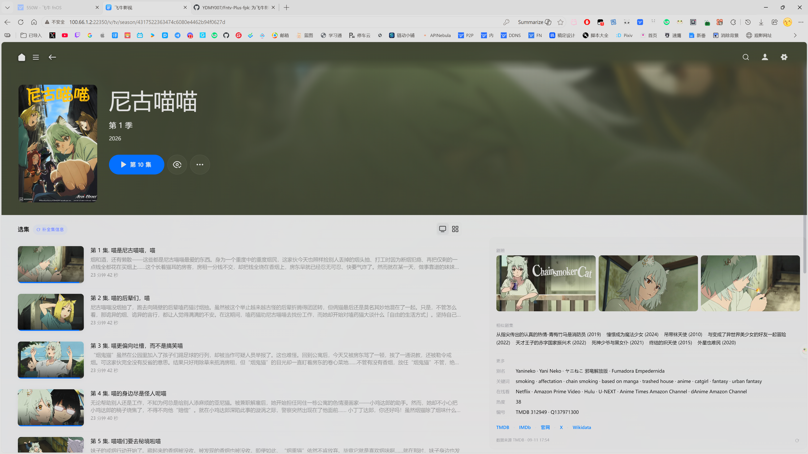

# Fntv-Plus · 飞牛影视网页端增强（fpk · Web 版）

[](https://github.com/YDMY007/Fntv-Plus-fpk)
[](https://github.com/YDMY007/Fntv-Plus-fpk/releases)
[](https://github.com/YDMY007/Fntv-Plus-fpk/releases)
[](https://github.com/YDMY007/Fntv-Plus-fpk/commits/main)
[](https://github.com/YDMY007/Fntv-Plus-fpk/commits/main)
[](https://github.com/YDMY007/Fntv-Plus-fpk)
[](https://github.com/YDMY007/Fntv-Plus-fpk)
[](https://go.dev)
[](https://nodejs.org)
[](https://www.fnnas.com)
[](https://github.com/YDMY007/Fntv-Plus)
[](LICENSE)

为飞牛影视（fnOS 影视应用）网页端打造的**界面增强应用**——以一个 fpk 包装进 fnOS，通过反向代理把增强能力注入到影视网页，**浏览器打开即是增强版**，电视 / 平板 / 手机 / 电脑全设备生效，无需在每台设备上装任何东西。

> **本项目为个人练手作品，与飞牛 / fnOS 及官方影视应用无任何隶属关系。**
> 需要完整桌面体验（MPV 硬解 / 原盘播放）？

> 前往桌面客户端：**https://github.com/YDMY007/Fntv-Plus**

---

<div align="center">
  
  <p><em>图：web端实机展示</em></p>
</div>

<div align="center">
  
  <p><em>图：详情页增强</em></p>
</div>

<div align="center">
  
  <p><em>图：演员入库检测</em></p>
</div>

## 实现方式

与"改影视应用文件"的侵入式方案完全不同，Fntv-Plus Web 版是一个**旁路反向代理 + 前端注入**架构：

```
浏览器 ──► 飞牛统一网关（/app/fntvplus/*，NAS 登录态校验）
             │  Unix socket 转发（应用不监听公网端口）
             ▼
          Fntv-Plus 服务（Go 反代, 应用目录内 socket + 127.0.0.1 回环）
             │  ① HTML 响应注入 <script>（增强 payload, 1.1MB 单文件）
             │  ② 其余请求（API/视频 206/图片）原样透传飞牛影视
             ▼
          飞牛影视应用（fnOS 官方 trim.media, 端口 5666）—— 零改动
```

- **统一网关接入**：桌面入口与增强页面均经 fnOS 官方网关 `/app/fntvplus/*` 访问（Unix socket），网关先校验 NAS 登录态再转发，并注入 `X-Trim-Userid` 等身份头；服务本体只监听应用目录 socket + 127.0.0.1 回环（仅本机健康检查/调试），**不对局域网开放任何 TCP 端口**；管理页/设置 API/桥接接口一律要求网关身份，无身份请求返回 401；
- **增强 payload**：由复用自桌面客户端的前端代码打包成单文件 IIFE（esbuild），内含全部美化 / 弹幕 / 同步 / 设置功能，通过注入的 `<script>` 在影视页面内运行；
- **Go 反代后端**：负责 HTML 注入、payload 分发（内容哈希长缓存）、会话透传（cookie + Authx 签名）、以及一组桥接 API（TMDB / Bangumi / 豆瓣 / Trakt / 弹弹play / 弹幕搜索等，解决浏览器 CORS 与签名问题）；
- **数据回填**：改元数据一律走飞牛官方编辑接口（`getEditDetail` / `saveEditDetail` + 字段锁），**从不直写数据库、不改任何系统文件**；
- **卸载即还原**：影视应用本身从未被修改，卸载 fpk 后通过飞牛影视原始端口访问，一切如初。

## 安全说明

- **不 root**——以 fnOS 包用户（package）身份运行，最小权限；
- **不监听公网端口**——主入口走飞牛统一网关（Unix socket + 登录态校验），TCP 仅绑 127.0.0.1 供本机健康检查；管理/桥接接口要求网关身份头，免登录直连一律 401；
- **不收集、不上传任何数据**——所有配置与缓存在本机应用数据目录（`@appdata/fntvplus`）。唯一的例外是可关闭的**匿名使用统计**（默认开，只上报「随机匿名 ID + 版本号 + 系统类型 + 日期」四项，用于统计有多少台 NAS 在用；不含账号 / IP / 媒体库 / 文件路径，服务端也不存 IP，设置面板「关于」页可一键关闭或重置匿名 ID）——详见 [docs/匿名统计说明.md](docs/匿名统计说明.md)；
- **最小网络面**——后端仅访问本机影视服务与配置的数据源（TMDB / Bangumi / 豆瓣 / 弹弹play / 弹幕源），外部域名白名单；
- **凭证加密存储**——弹弹play 内置凭证以密文形态编译进二进制（不含明文，`grep`/`strings` 拿不到），自定义凭证落盘前经 AES-256-GCM 加密（密钥含每安装随机盐，单独拷走 `config.json` 解不开），设置 API 下发的配置里 Secret 字段一律遮蔽；
- **不改系统**——不写入 fnOS 系统目录，不修改影视应用文件；影视官方升级与本应用互不影响；
- **源码公开**——全部代码在本仓库与桌面客户端仓库，可自行审计；
- **个人练手作品**——非商业软件，与飞牛 / fnOS 官方无任何隶属关系。

## 安装

1. fnOS 应用中心 →「手动安装」→ 上传 `Fntv-Plus-vXXX.fpk`；
2. 安装后桌面出现两个入口：**影视 Plus**（增强页面，经飞牛统一网关 `/app/fntvplus/` 访问，自动复用 NAS 登录态）与 **Fntv-Plus 设置**（配置面板）；
3. 增强能力经反向代理注入，影视原生端口（默认 5666）访问不变，两者互不影响。

> 升级：应用中心卸载时选「保留数据」→ 安装新包 → 设置与缓存自动恢复。

## 功能一览

### 界面增强
- **海报墙 / 分类页美化**：毛玻璃 / 圆角 / 沉浸式视觉优化
- **首页轮播图**：4 种样式（含 3D 立体旋转木马），元数据驱动，手机尺寸自动适配（纯海报画面）
- **轮播 Logo / 首页 Logo 自定义**：TMDB 透明标识自动替换 + 24 个流媒体平台预设 / 自传图片
- **详情页美化**：沉浸底图 / 两栏布局 / 磨砂卡片；**序号视图**（纯数字选集）同享美化
- **TMDB 增强**：评分 / 演员 / 每日放送（Bangumi / TMDB / 豆瓣聚合）

### 播放与弹幕
- **弹幕**（网页播放器 canvas 渲染）：B站三路搜索（扫码登录）+ 自建 danmu_api 优选 + 弹弹play 官方开放 API 兜底（内置凭证开箱即用）+ 手动搜索候选（多源并存）
- **弹幕源优先级**：自建源 → B站 → 弹弹play（兜底）；命中条数低于下限（默认 100，可调；0=不启用）才继续往下探。弹弹play 有 API 配额，仅当前两个源都没拿到足量弹幕时才请求
- **手机适配**：弹幕按钮触屏开合、面板窄屏自适应、字号优化
- **播放底栏触控适配**：按钮热区 / 字号 / 进度条触控带按手机优化
- **弹幕设置**：字号 / 描边 / 透明度 / 显示范围 / 屏蔽类型与屏蔽词
- **跳过片头**、**播放记忆**（续播跨设备同步）

### 同步与刮削
- **豆瓣同步**：播放进度 → 在看；标记已观看 → 看过（自定义 Cookie，字段锁防覆盖）
- **Bangumi 同步**：进度达到阈值自动标记（多路传输：自定义代理 / 公共 DNS 直连 / 系统）
- **Trakt 同步**：设备授权登录，播放 scrobble（start/pause/stop 自动上报）+ 全库已观看同步
- **自定义刮削源回填**：季页一键把标题/季号/TMDB id 等锚点发给你的刮削服务，分集标题与简介经官方接口回填（精确锚点匹配：tmdb_id > trim_id > imdb_id > douban_id）
- *自定义刮削服务*（设置面板占位）：多源聚合接入，开发中

### 观影与工具
- **观影记录**：侧边栏面板 + 年度观影报告
- **库索引 / 已入库角标**：item/list 分页主源
- **诊断与实时日志**：版本 / 上游连通性 / 开关状态 / 前后端日志合并视图
- **匿名使用统计**（可关闭）：每天最多一次心跳，只报「匿名 ID + 版本 + 系统 + 日期」，用于统计多少台 NAS 在用；「关于」页可关闭 / 重置匿名 ID（[说明](docs/匿名统计说明.md)）

## 设置面板

侧栏 ⚙ 打开，6 个分类：

| 分类 | 内容 |
|---|---|
| 通用 | 主题模式 / 界面交互 / 跳过片头 |
| 弹幕 | B站登录 / 弹弹play（内置凭证 + 可选自定义）/ 自建源 / 屏蔽与样式 |
| 账号与网络 | Bangumi Token / TMDB Key / 豆瓣 Cookie / 自定义代理 / TMDB 免梯子直连 |
| 自定义刮削 | 自定义刮削服务（未正式生效，置顶）/ 自定义刮削源 / Fanart.tv / TVMaze / OMDb / MyAnimeList / Jav 刮削 |
| 诊断与日志 | 诊断信息 / 调试日志 |
| 关于 | 项目信息 / 匿名使用统计（开关 / 立即上报 / 重置匿名 ID） |

## 打包（从源码构建）

| 通道 | 命令 | 版号规则 | 产物 |
|---|---|---|---|
| **开发测试版** | 双击 `一键打包.bat`（或 `build-fpk.exe build`） | 3 段式 `x.y.z`（打包器自动维护 manifest） | `Fntv-Plus-v<号>.fpk` |
| **正式发布版** | 双击 `发布打包.bat` → 网页 GUI（`127.0.0.1:8199`） | 网页上填写的正式版号（大写 V） | `Fntv-Plus-V<版号去点>.fpk` |

> 飞牛商店要求版本号固定 3 段式 `x.y.z`（可带数字预发布后缀 `x.y.z-n`）；4 段式无效。

依赖：Node.js（payload 打包）+ Go 1.23+（后端交叉编译）+ `tools/fnpack.exe`（飞牛官方打包工具）。版号由打包器自动维护（写入 manifest），后端 `/api/status` 与侧栏显示均从此读取。

## Web 版 vs 桌面客户端

| | Web 版（fpk） | 桌面客户端 |
|---|:---:|:---:|
| 形态 | fnOS 应用，NAS 装一次全设备浏览器即用 | Windows 安装包 |
| 海报墙 / 轮播 / 详情页美化 / Logo | ✅ | ✅ |
| B站弹幕 + 弹弹play + 自建源 + 手动搜索 | ✅ | ✅（MPV 渲染） |
| 手机网页适配 | ✅ | — |
| 豆瓣 / Bangumi 同步 | ✅ | ✅ |
| 自定义刮削源回填 + Jav 番号刮削 | ✅ | ✅ |
| 跳过片头 / 播放记忆 / 观影记录 | ✅ | ✅ |
| MPV 硬解 / 原盘 / 高级字幕 / 外部播放器 | ❌ | ✅ |
| Trakt 同步（scrobble + 已观看） | ✅ | ✅ |
| 手柄遥控 | ❌ | ✅ |
| 播放器内缩略图预览 | ❌ | ✅ |

> 用电视 / 平板 / 手机为主 → **Web 版**；Windows PC 重度观影 → **桌面客户端**。可共存。

## 相关仓库

- **桌面客户端**：https://github.com/YDMY007/Fntv-Plus
- **刮削方案研究**（NAS 存储探查报告 / 部署方案）：https://github.com/YDMY007/fnos-bangumi-scraper

## License

MIT
